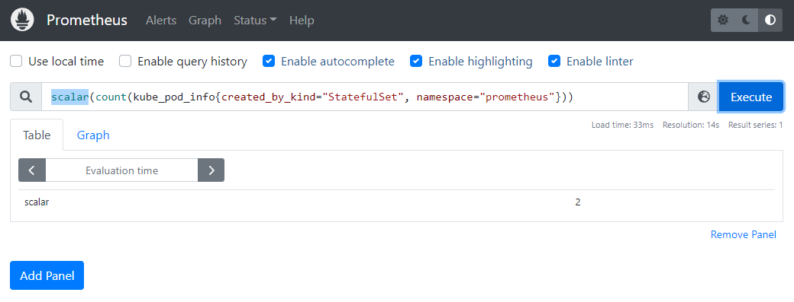

# DevOps with Kubernetes 2022
DevOps with Kubernetes is an introduction to Kubernetes with K3s and GKE.

# Exercise 4.03: Prometheus

# Exercise 4.07: GitOpsify Cluster

https://github.com/melxi/kube-cluster-dwk