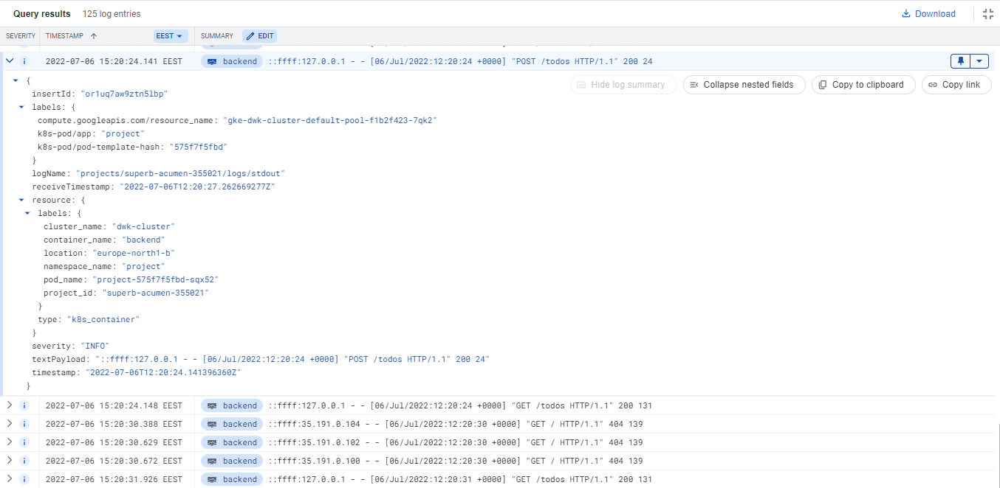

# DevOps with Kubernetes 2022
DevOps with Kubernetes is an introduction to Kubernetes with K3s and GKE.

# Exercise 3.06: DBaaS vs DIY
## DBaaS
### Pros
- Low maintenance
- High availability
- Better scalability
- Disaster recovery
- Automatic backups

### Cons
- Less control
- Higher costs

## DIY
### Pros
- More control
- Lower costs

### Cons
- High maintenance
- Limited scalability
- Manual backups

# Exercise 3.07: Commitment

We have chosen to use Postgres with PersistentVolumeClaim in the project since it was already in use
in previous parts of this course

# Exercise 3.10: Project v1.6

